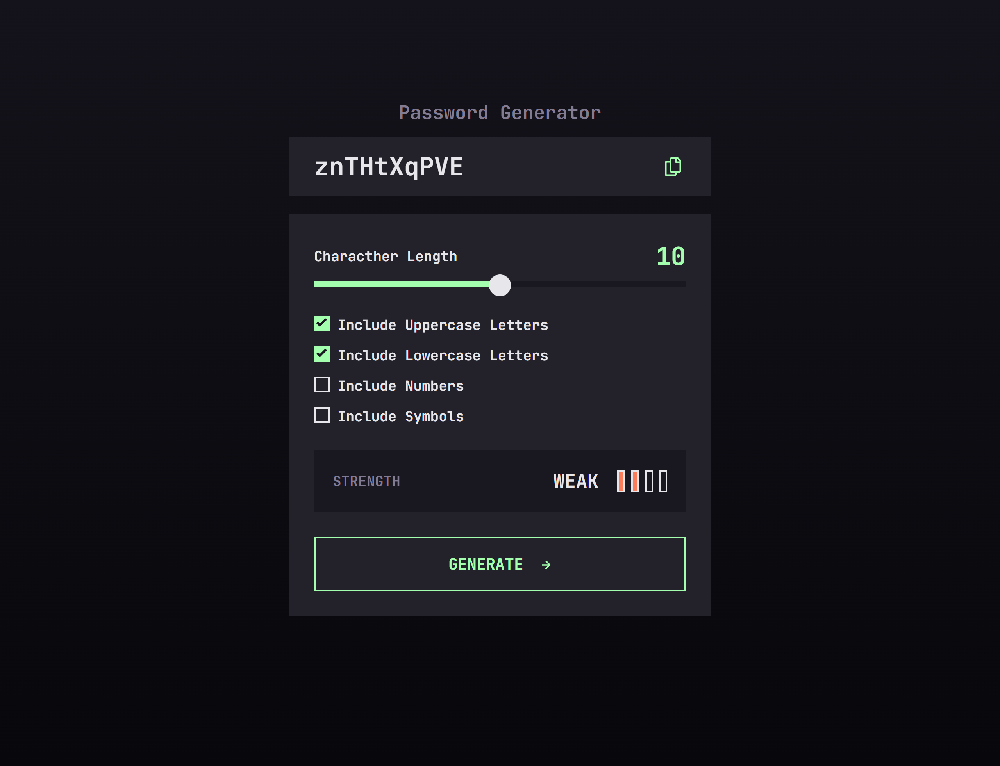

# Frontend Mentor - Password generator app solution

This is a solution to the [Password generator app challenge on Frontend Mentor](https://www.frontendmentor.io/challenges/password-generator-app-Mr8CLycqjh). Frontend Mentor challenges help you improve your coding skills by building realistic projects.

## Table of contents

-   [Overview](#overview)
    -   [The challenge](#the-challenge)
    -   [Screenshot](#screenshot)
    -   [Links](#links)
-   [My process](#my-process)
    -   [Built with](#built-with)
    -   [What I learned](#what-i-learned)
    -   [Useful resources](#useful-resources)
-   [Author](#author)

## Overview

### The challenge

Users should be able to:

-   Generate a password based on the selected inclusion options
-   Copy the generated password to the computer's clipboard
-   See a strength rating for their generated password
-   View the optimal layout for the interface depending on their device's screen size
-   See hover and focus states for all interactive elements on the page

### Screenshot

### Links

-   Solution URL: [Solution URL here](https://github.com/Andro87/password-generator-app.git)
-   Live Site URL: [Live site URL here](https://password-generator-app-beta.vercel.app/)

## My process

### Built with

-   Semantic HTML5 markup
-   Flexbox
-   SASS / SCSS
-   [React](https://reactjs.org/) - JS library
-   [Next.js](https://nextjs.org/) - React framework

### What I learned

This project straightened my knowledge of React and Javascript as it tested it through all the specific aspects I had to pay attention to.
While working on the project, the main difficulties I encountered
have regarded how to create a custom slider bar and checkboxes and generate a random password based on the user's selected inclusion options.
Aspects like password validation and how to establish its strength are open to improvements in the future.
It was a great challenge to work on as it allowed me to focus on different aspects and cases a user could face when interacting with this app.

### Useful resources

-   [How to add copy to clipboard functionality in a ReactJs App](https://medium.com/nerd-for-tech/how-to-add-copy-to-clipboard-functionality-in-a-reactjs-app-45404413fdb2) - This helped to copy the generated password to the computer's clipboard.
-   [Creating A Custom Range Input That Looks Consistent Across All Browsers](https://www.smashingmagazine.com/2021/12/create-custom-range-input-consistent-browsers/) - This is article helped me to learn more about how to create a custom range input and apply this concept to my case.

## Author

-   Frontend Mentor - [@Andro87](https://www.frontendmentor.io/profile/Andro87)
